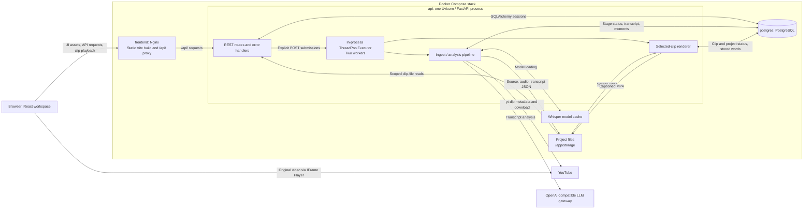
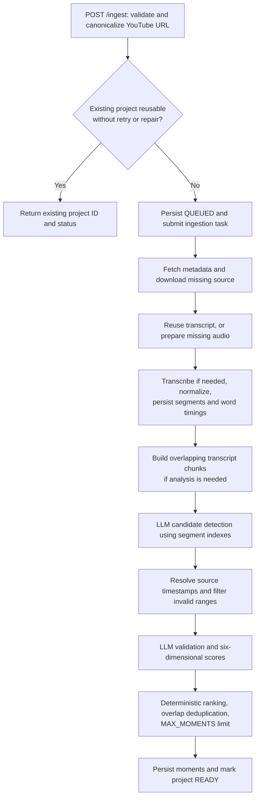
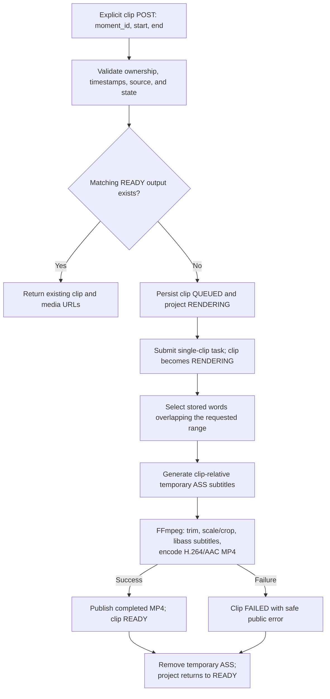

# LazyClipper Architecture

## Overview

LazyClipper turns a YouTube video into persisted, timestamp-grounded moment suggestions and user-requested captioned clips. The current MVP has two processing workflows:

1. **Ingest and analyze:** download the source, extract audio, transcribe the full video with word timings, normalize and chunk the transcript, and detect, validate, score, and deduplicate moments.
2. **Render a selected clip:** use one moment's requested timestamps, the saved source video, and stored word timings to produce a captioned 1080×1920 MP4.

The original video plays through YouTube's IFrame Player API. Generated clips play through project-scoped backend media routes. Ingestion completes with saved moments; clip rendering begins only after an explicit clip request.

This document describes the implemented architecture. See [README.md](README.md) for setup, configuration, and usage, and [AGENTS.md](AGENTS.md) for development invariants and verification guidance.

## Runtime topology



### Deployment and dependencies

The stack in [docker-compose.yml](docker-compose.yml) contains three services:

| Service | Runtime and role | Default host port | Persistent data |
| --- | --- | --- | --- |
| `frontend` | Nginx serving the compiled app and proxying API/docs/health to `api:8000` | `5173` on the configured Tailscale address only | Assets built into the image |
| `api` | Python 3.12, FastAPI/Uvicorn, synchronous SQLAlchemy, and the processing thread pool | None; internal `8000` | `./storage:/app/storage` and `whisper_cache:/root/.cache` |
| `postgres` | PostgreSQL 16 | None; internal `5432` | `postgres_data` volume |

The backend image provides the processing dependencies:

- **`yt-dlp` + `yt-dlp-ejs` + Node 22:** YouTube metadata, MP4 download, and JavaScript challenge solving. Python package pins live in [pyproject.toml](pyproject.toml).
- **`whisper-timestamped`:** full-source speech transcription with word start/end times, using Whisper/PyTorch. `WHISPER_MODEL` and `WHISPER_DEVICE` control the model and device; the default device is CPU.
- **FFmpeg with libass:** audio extraction, vertical crop/encoding, and ASS subtitle burn-in. `ffprobe` is also installed for media inspection and verification.
- **OpenAI Python SDK:** calls the configured external gateway using `LLM_BASE_URL`, `LLM_API_KEY`, and `LLM_MODEL`, with bounded timeouts/retries.

The [backend Dockerfile](backend/Dockerfile) caches dependency installation separately from application source. Its non-x86 build pins the compatible CPU Torch/Torchaudio wheels. The [frontend Dockerfile](frontend/Dockerfile) uses `npm ci` and a TypeScript/Vite build before copying assets into Nginx.

`VITE_API_BASE_URL` is embedded at frontend build time. An empty value selects the same-origin Nginx proxy; a separate API origin requires a rebuild. Local Vite development uses the API client's `http://localhost:8000` default when the variable is unset.

Optional YouTube cookies are mounted read-only into the API container. The ingestion service uses a temporary writable copy for yt-dlp and ignores an absent/non-file cookie path. Cookies remain runtime authentication material, outside images, environment-file contents, and logs.

The private frontend binding and tailnet policy define the trusted single-user access boundary. The API/database cannot bypass it through published ports. Compose disables CORS; local non-Compose Vite origins are explicitly configurable. Database passwords are installation-specific file secrets under ignored `.secrets/`; the API receives only the non-superuser application credential. `scripts/setup-database-role.sh` handles fresh initialization and an explicit, backed-up upgrade for existing volumes, preserving table ownership/data. The application retains schema-local CREATE permission for current table initialization; schema migration administration is separate from its runtime DML permissions. See README for the existing-volume procedure.

### Execution and startup

- [main.py](backend/app/main.py) initializes database tables, creates `ThreadPoolExecutor(max_workers=2)`, and registers separate ingestion and single-clip runners.
- Startup validates transcript-window relationships and required non-placeholder LLM configuration before database initialization, executor/admission creation, or expensive work. It validates syntax/presence only and makes no provider request.
- POST routes reserve bounded capacity before persisting a queued request and submitting its IDs to the executor. Two active jobs plus four waiting is the default; excess requests return retryable HTTP `429` without changing job records. `GET /api/v1/processing` exposes active/queued/reserved counts, available capacity, and oldest queued age.
- Each executor thread supervises a Linux process group with a tiny parent-death guard and a pipeline child using new database sessions. Whole-job deadlines include download/model initialization/transcription/analysis. Timeout/shutdown kills descendants, reaps the direct child and confirms the group stopped before scoped failure persistence. An unconfirmed kill or failed failure-persistence disables admission. The guard kills its group on abrupt API-parent death without depending on model code releasing Python's GIL. This is local execution isolation, not a separate worker service or queue.
- A process-local submission lock with a bounded acquisition wait serializes duplicate checks and submissions. It coordinates the current single API process; it is not a distributed lock. PostgreSQL connect/pool, statement and lock deadlines are explicit, with TCP dead-peer detection. Settings/source/clip policies are documented in README.
- Database stages are persisted, but executor tasks are in memory. Before creating the executor, [services/recovery.py](backend/app/services/recovery.py) atomically changes orphan ingestion jobs and active clips to retryable `FAILED` states with `PROCESSING_INTERRUPTED`. Rendering projects return to `READY`, while successful clips and saved artifacts are preserved. Recovery does not enqueue jobs or change GET semantics. A recovery transaction failure aborts startup. This policy requires one API process and the old process fully stopped before replacement; it is not a distributed lease or live-job timeout.
- PostgreSQL must become healthy before the API starts; the frontend waits for API readiness. `/health` remains a constant liveness response. `/ready` checks a local database `SELECT 1` and accepting admission state, without paid/provider calls. Compose's `unless-stopped` policy restarts services after process/host failures; startup recovery then reconciles abandoned jobs before accepting work.
- Uvicorn and Nginx routine access logs are disabled. Application stage events and redacted failure diagnostics remain in backend/container logs.

## Workflow 1: ingest and analyze

Entry point: `POST /api/v1/ingest` → admission reservation → `JobSupervisor.ingest(project_id)` → guarded child → `Pipeline.run()`.



Completed stages are reused; the diagram shows the dependency order when those stages are needed.

### Submission and stage reuse

The ingest route validates the YouTube host and video ID, canonicalizes the URL, and looks up the uniquely indexed canonical source URL. Existing project claims are row-locked; a concurrent insert conflict returns the winning project. A repeated submission returns an already queued, processing, or usable completed project instead of enqueueing it again. An explicitly submitted `FAILED` project, or a `READY` project whose source is missing, is reset to `QUEUED` and processed using saved stages once previous supervisor ownership has ended.

The pipeline checks persisted rows and non-empty files:

1. Fetch metadata and download the source only if the source file is absent.
2. If transcript rows already exist, reuse them. Otherwise, reuse valid audio or extract mono 16 kHz WAV audio, then transcribe and normalize it.
3. Save normalized `TranscriptSegment` rows, including available word timing data, and a `transcript.json` artifact. No valid normalized segments is a transcription failure.
4. Analyze only if `analysis_completed` is false. Persist selected moments with rank, composite score, dimension scores, source segment references, and the completion marker in one transaction, including zero-result analysis.
5. Mark the project `READY` for inspection and clip requests.

Reuse uses existing artifacts/rows plus the explicit analysis-completed marker, without a separate stage-history table. A valid analysis can return zero moments and remains reusable; malformed provider responses and service failures are handled as failures rather than fabricated results.

### Timestamp-grounded LLM analysis

[analysis/transcript.py](backend/app/analysis/transcript.py) cleans transcript data, merges short adjacent segments, splits long segments, and builds overlapping windows. Defaults are 300-second windows with 45 seconds of overlap. Word timestamps are the timing source for captions; proportional segment boundaries used for unaligned analysis data are not a replacement for word alignment.

[services/llm.py](backend/app/services/llm.py) performs detection and review per chunk:

1. The detection response identifies candidate start/end **segment indexes**.
2. The application resolves those indexes to transcript timestamps and original segment references. Invalid indexes and candidates outside the 15–180 second duration bounds are discarded.
3. Grounded candidates are sent for a second LLM review, which accepts/rejects them and supplies six scores: hook, clarity, standalone value, novelty, emotional interest, and payoff.
4. Strict Pydantic schemas validate the responses. Malformed JSON/schema output gets one correction attempt; transport/provider failures use the SDK's configured bounded retries.
5. [analysis/moments.py](backend/app/analysis/moments.py) computes weighted composite scores and keeps higher-ranked candidates when intervals overlap by at least 50% of the shorter interval. The analyzer limits the result to `MAX_MOMENTS` before the pipeline persists it.

Detection/review schemas allow up to five candidates per chunk. Prompt templates live in [backend/app/services/prompts](backend/app/services/prompts).

## Workflow 2: render one selected clip

Entry point: `POST /api/v1/projects/{project_id}/clips` → admission reservation → `JobSupervisor.render(project_id, clip_id)` → guarded child → `Pipeline.render_clip()`.

The request contains `moment_id`, `start`, and `end`. The route checks project/moment ownership, finite ordered timestamps, the source file, source duration when known, and processing conflicts. A saved moment and valid source can also be used from a `FAILED` project. The API permits one active clip render per project.

There is at most one persisted `Clip` per moment, created on request. A `READY` clip with the same timestamps and an available file is reused. Failed/missing outputs or changed timestamps reuse that clip record for a new render.



Failures elsewhere in the render path are handled by the same per-clip failure boundary. An individual clip failure leaves saved analysis and other clips available. Clip retries use the same explicit POST flow.

`MediaService.render_clip()` center-crops to 1080×1920, encodes H.264 (`libx264`, `yuv420p`) at 30 fps, includes AAC audio when the source has audio, and enables MP4 fast start. It writes `<clip_id>.partial.mp4` and publishes `<clip_id>.mp4` only after a successful, non-empty output. Temporary partial files are cleaned up.

The pipeline retains an explicit legacy/backfill `render_clips()` helper. Normal ingestion and the current clip POST route do not invoke that helper.

### Caption generation and highlighting

[services/captions.py](backend/app/services/captions.py) uses standard-library Python to generate ASS subtitles from stored word data:

- `select_words()` selects overlapping words and clamps their start/end times to the clip range.
- `build_ass()` converts source timestamps to clip-relative times and emits one dialogue event per spoken word, with a sliding window of up to four words.
- The current word uses amber `#FFBF00` via the ASS override `{\c&H0000BFFF&}`; surrounding words use white via `{\c&H00FFFFFF&}`. ASS colors use blue-green-red ordering.
- `ASS_HEADER` defines the font, size, background, and bottom-centered placement. FFmpeg's `subtitles` filter uses **libass** to render these styles into the video frames.
- `Pipeline._render_clip_media()` removes the temporary `<clip_id>.ass` file in `finally`, on both success and failure.

`whisper-timestamped` supplies timing, the caption generator selects highlighting, and FFmpeg/libass renders it. The React player plays the resulting MP4. Changing the caption style requires rerendering an output; submitting an unchanged, valid `READY` clip currently reuses the existing file.

## Persistent state and storage

### Relational model

[models.py](backend/app/models.py) defines the SQLAlchemy entities:

| Entity | Relationship | Persisted data |
| --- | --- | --- |
| `Project` | Root entity; unique canonical source URL | Title, project status, completed-analysis marker (including zero moments), safe status/error messages, created/updated timestamps |
| `Video` | At most one per project | YouTube ID, title, duration, thumbnail URL, backend-only source/audio paths |
| `TranscriptSegment` | Many per project; unique `(project_id, segment_index)` | Segment start/end, text, optional speaker, ordering index, JSON `words` data |
| `Moment` | Many per project | Title, description, reason, source timestamps, rank, composite score, dimension scores, source segment indexes |
| `Clip` | Belongs to project and moment; unique `moment_id` | Requested timestamps, clip status, backend-only output path, safe error message |

PostgreSQL is the source of truth for project state and structured results. API requests and pipeline tasks use separate synchronous SQLAlchemy sessions. [db.py](backend/app/db.py) caches engines, enables connection pre-ping, and hides SQL parameters in exception formatting.

Startup calls `migrations.ensure_schema()`: fresh databases get the current schema and revision, while existing databases must already have the expected revision/critical definitions. Explicit `python -m backend.app.migrations upgrade` performs transactional, versioned upgrades with the API stopped and a verified coordinated backup. Revision 1 canonicalizes legacy source identity, refuses ambiguous/invalid data, adds uniqueness/lookup indexes and backfills `analysis_completed` while retaining child rows/files. Normal runtime never silently alters an existing schema; see README for the table-owner maintenance connection.

### Filesystem artifacts

```text
storage/projects/<project_id>/
├── source/
│   └── video.mp4
├── audio/
│   └── audio.wav
├── transcript/
│   └── transcript.json
└── clips/
    ├── <clip_id>.mp4
    ├── <clip_id>.ass          # temporary caption input during rendering
    └── <clip_id>.partial.mp4  # temporary encoding output

storage/projects/.trash/<project_id>-<token>/  # short-lived explicit-delete quarantine
```

The database stores media references, not media bytes. The API checks clip ownership and resolves served files within the requested project's `clips` directory. JSON exposes origin-relative media/download paths rather than filesystem paths; `api.ts` prepends the explicitly configured API origin only when one is configured. The downloaded source remains backend-only; there is no source-video media endpoint. `storage.py` scopes project paths, checks a 50 GiB default tree budget plus per-admission/low-free-space reserve, atomically writes reusable text artifacts, and removes only known temporary/quarantine paths at startup after old work has been reconciled. Explicit DELETE quarantines one project before its database cascade and retries/restores known quarantine paths after a hard kill according to whether the database row remains.

GET requests remain read-only. If a `READY` clip's file is missing or outside its allowed directory, the clip-list response presents a safe `FAILED` media state and omits URLs without mutating the saved row. An explicit clip POST can retry the missing output.

### Project and clip statuses

| Lifecycle | Progression | Failure behavior |
| --- | --- | --- |
| Ingestion/analysis | `QUEUED → INGESTING → TRANSCRIBING → ANALYZING → READY` | Project becomes `FAILED` with a safe stage message; saved earlier stages are retained |
| Selected clip | `QUEUED → RENDERING → READY` | Clip becomes `FAILED`; the project returns to `READY` so analysis remains usable |
| Project during clip generation | Eligible project → `RENDERING → READY` | Clip-level failure is represented on the clip |

Persisted stages can be skipped during retries. Failure persistence is best-effort if the database itself is unavailable; a secondary persistence failure is logged. No demo transcript, moments, or media are substituted for a failed stage.

## API and frontend behavior

### API surface

All project routes are registered under `/api/v1` in [api/routes.py](backend/app/api/routes.py).

| Method and path | Responsibility |
| --- | --- |
| `POST /api/v1/ingest` | Validate/reuse a project, or persist and submit explicit ingestion/retry/source repair |
| `GET /api/v1/projects` | List saved projects with bounded `limit`/`offset` pagination |
| `GET /api/v1/projects/{project_id}` | Read project and source metadata, including the YouTube video ID |
| `DELETE /api/v1/projects/{project_id}` | Explicitly delete one terminal project and its scoped media |
| `GET /api/v1/projects/{project_id}/status` | Read persisted project progress or public failure |
| `GET /api/v1/projects/{project_id}/transcript` | Read persisted segments; `include_words=false` omits word JSON from both query and response |
| `GET /api/v1/projects/{project_id}/moments` | Read ranked saved moments |
| `POST /api/v1/projects/{project_id}/clips` | Reuse or submit one requested clip; retry a failed/missing output |
| `GET /api/v1/projects/{project_id}/clips` | Read clip statuses and available media/download URLs |
| `GET /api/v1/projects/{project_id}/clips/{clip_id}/media` | Serve a scoped clip with byte-range support; `?download=true` uses attachment disposition |
| `GET /health` | Cheap API process liveness response |
| `GET /ready` | Database and local processing readiness, without provider calls |
| `GET /api/v1/processing` | Read-only active/queued/reserved capacity snapshot |

Opening a saved project through `?project_id=...`, refreshing, and previewing media issue read requests. Only explicit POST requests start work.

### Workspace and polling

- [App.tsx](frontend/src/App.tsx) owns form/selection state, saved project navigation, metadata, transcript, moments, clip actions, and playback.
- [api.ts](frontend/src/api.ts) owns typed requests, URL construction, response parsing, and a 30-second request timeout.
- [projectUpdates.ts](frontend/src/projectUpdates.ts) drives a single status poll loop and passes observed status into refresh boundaries. The workspace loads all details initially, reuses successfully loaded transcript/moments during clip-only refreshes, and invalidates that per-project cache on ingestion transitions/resubmission. During processing, only `/status` is polled, with a four-second delay between completed cycles.
- Saved projects load 25 at a time with an explicit append/retry action. Workspace transcript reads use the segment-only SQL projection; word timings remain persisted for rendering and available through the full transcript response.
- Polling stops at `READY`/`FAILED`. Explicit clip creation or retry restarts state loading and polling, so completion refreshes the saved clip and its preview/download links. POST requests are never retried automatically.
- The original video uses the YouTube IFrame Player API and its video ID. Selecting a moment or transcript segment seeks that player. Generated clips use HTML video playback against the scoped API URL.
- [errors.ts](frontend/src/errors.ts) maps stage/client error codes to local, application-owned messages. Network failures/timeouts display `Unable to reach the server. Please try again.`

## Public errors and internal diagnostics

Error handling spans the pipeline, API serialization, exception handlers, and frontend display:

| Module | Responsibility |
| --- | --- |
| [backend/app/errors.py](backend/app/errors.py) | Public stage messages, safe client-error allowlist, database exception classification, and legacy stored-error classification |
| [backend/app/api/errors.py](backend/app/api/errors.py) | Sanitize HTTP, request validation, database, and unhandled exceptions into public error envelopes |
| [backend/app/schemas.py](backend/app/schemas.py) | API contracts and sanitization of failed project/clip rows, including legacy raw errors |
| [backend/app/logging.py](backend/app/logging.py) | Stage events, project/clip context, redacted server diagnostics, and concise expected-client rejection events |
| [frontend/src/errors.ts](frontend/src/errors.ts) | Safe local error display for API failures, proxy responses, and legacy/malformed error text |

A persisted analysis failure includes:

```json
{
  "status": "FAILED",
  "failed_stage": "analysis",
  "error": {
    "code": "PROCESSING_ERROR",
    "message": "Internal server error during AI analysis."
  }
}
```

HTTP error envelopes use lowercase `"failed"`. Safe application-authored input/conflict/not-found errors use allowlisted codes such as `INVALID_URL` or `CLIP_BUSY`. Successful response shapes remain compatible.

Failure stages are `ingestion`, `fetching`, `transcription`, `analysis`, `rendering`, `media`, `database`, and `unknown`. They are distinct from project statuses: for example, a metadata failure is `fetching` while the project was `INGESTING`.

New failures store only canonical public messages in existing `error_message` fields. Serialization derives `failed_stage` and the structured `error` from those messages; these are not new database columns. Legacy raw errors are classified and sanitized on read without rewriting the rows. Technical exception details, provider execution IDs, credentials, and raw HTTP `detail` are not frontend error messages.

Logs record project/clip IDs, stage started/completed/failed events, exception types, and redacted tracebacks. Credential fields, URLs, request/prompt/transcript payload fields, validation inputs, and SQL parameter dumps are redacted or excluded by the logging layer. Database driver diagnostics are reduced to exception class/SQLSTATE plus a short generic transport allowlist; arbitrary inline driver messages are not retained. Expected 4xx/507 request rejections are warning-level events without tracebacks. Uvicorn exception diagnostics use the same redaction path, and routine HTTP client logs are reduced.

## Implementation map

These relative links follow the current repository rather than a hard-coded repository name or branch.

| Area | Source | Main responsibility |
| --- | --- | --- |
| Application lifecycle | [backend/app/main.py](backend/app/main.py) | FastAPI setup, database initialization, error/logging setup, two-worker executor |
| REST boundary | [backend/app/api/routes.py](backend/app/api/routes.py) | Submission/reuse rules, persisted reads, scoped clip media |
| Orchestration | [backend/app/services/pipeline.py](backend/app/services/pipeline.py) | Reusable stages, single-clip render, status persistence, failure isolation |
| Runtime configuration | [backend/app/config.py](backend/app/config.py) | Environment settings, cached settings, project directory creation |
| YouTube ingestion | [backend/app/services/youtube.py](backend/app/services/youtube.py) | URL validation, metadata, download, yt-dlp/EJS/cookie setup |
| Media processing | [backend/app/services/media.py](backend/app/services/media.py) | Bounded FFmpeg subprocesses, audio extraction, captioned vertical MP4 encoding |
| Transcription | [backend/app/services/transcription.py](backend/app/services/transcription.py) | Lazy Whisper model loading and word-timestamped full-source transcription |
| Transcript preparation | [backend/app/analysis/transcript.py](backend/app/analysis/transcript.py) | Normalization and overlapping analysis windows |
| LLM analysis | [backend/app/services/llm.py](backend/app/services/llm.py) | Detection, timestamp grounding, review, schema correction, candidate selection |
| Moment rules | [backend/app/analysis/moments.py](backend/app/analysis/moments.py) | Structured schemas, weighted scoring, overlap deduplication |
| Captions | [backend/app/services/captions.py](backend/app/services/captions.py) | Stored-word selection and styled ASS event generation |
| Database | [backend/app/db.py](backend/app/db.py), [backend/app/models.py](backend/app/models.py) | Sessions, table creation, persistent entities and relationships |
| Frontend proxy | [frontend/nginx.conf](frontend/nginx.conf) | Static assets, Docker API proxy, unbuffered clip responses |

## Verification

From the repository root, backend checks run in this order:

```bash
. .venv/bin/activate
python -m compileall -q backend
ruff check backend
pytest -q
```

Frontend checks run from `frontend/` with Node 22+:

```bash
npm test
npm run build
```

[Backend tests](backend/tests) use temporary SQLite databases and mocked external services for deterministic checks of API contracts, saved-stage reuse, clip isolation, captions, and error redaction. The real MP4 smoke test uses FFmpeg/ffprobe when available. [Frontend tests](frontend/tests) use Node's test runner and the existing Vite toolchain for request/error boundaries and polling behavior.

For caption changes, run `pytest -q backend/tests/test_captions.py backend/tests/test_pipeline.py backend/tests/test_clipping.py` and check `ffmpeg -hide_banner -h filter=subtitles` (or `docker compose exec api ffmpeg -hide_banner -h filter=subtitles`). Native subtitle support must be present for actual rendering.

Real YouTube, Whisper, and LLM integration checks require the configured services and model dependencies described in [README.md](README.md). The product remains a single-process MVP with explicit user-requested clip generation; advanced editing, intelligent reframing, publishing, and social integrations are outside its current scope.
