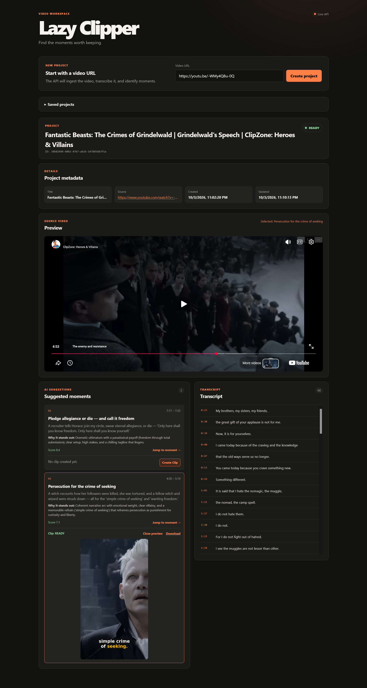
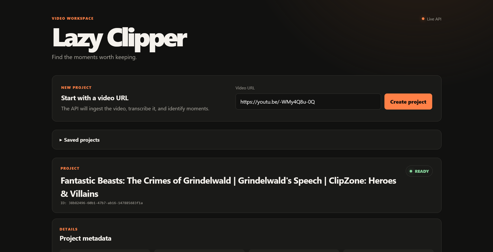
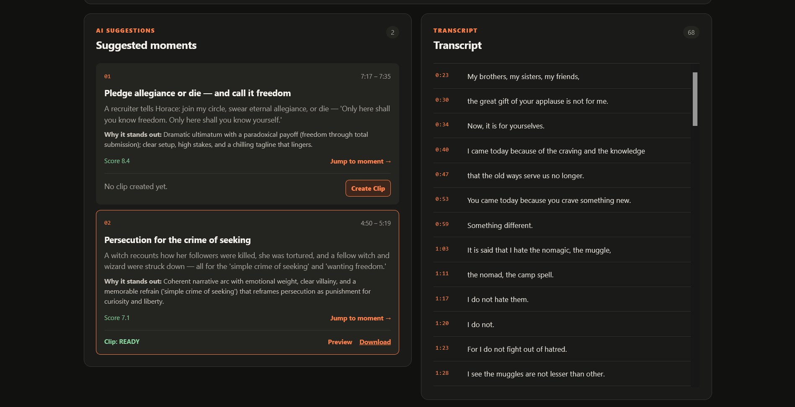

# LazyClipper MVP

LazyClipper turns a long-form YouTube video into timestamped clip candidates and captioned vertical clips. Paste a video URL, let the app find moments worth keeping, then render only the clips you choose.

For component boundaries, data flow, persistence, runtime topology, and detailed processing workflows, see [ARCHITECTURE.md](ARCHITECTURE.md).



The backend keeps the downloaded source for word-timestamped Whisper/LLM processing, but the frontend plays the original through YouTube's IFrame Player API. A suggested moment only becomes a deterministic center-cropped 9:16 MP4 (H.264 video, AAC audio) with burned-in word captions after the user clicks **Create Clip**. Advanced editing, intelligent reframing, publishing, and social integrations remain out of scope.

Full-video transcription persists segment and word timestamps once. Clip creation selects the stored words overlapping the requested range, writes a temporary ASS subtitle file, and burns it into only that requested clip; it never transcribes the clip again or renders captions for the original video.

There are no demo or static-data fallbacks. If ingestion, audio extraction, transcription, or LLM analysis fails, the project is persisted as `FAILED` with a safe stage-specific message. Technical exception diagnostics stay in redacted backend logs. Individual clip-render failures are stored on the clip; other clips continue, and the project remains usable.

## What you can do

- Submit a YouTube URL and create a reusable project.
- Inspect the original video through YouTube, alongside its transcript and AI-ranked moments.
- Jump to a suggested moment before deciding whether to create a clip.
- Render a selected moment as a center-cropped 1080×1920 MP4 with burned-in word captions.
- Preview or download completed clips, and retry individual failed renders without rerunning analysis.

### Start a project

The workspace begins with a focused URL entry point and keeps saved projects available for later inspection.



### Review moments and transcript

When processing completes, suggested moments appear beside the timestamped transcript. Selecting a moment seeks the YouTube player; creating a clip is always an explicit action.



## Requirements

- Docker with BuildKit and Docker Compose v2+ for the recommended setup
- A YouTube-accessible URL for the selected video
- An OpenAI-compatible LLM gateway, such as FreeLLMAPI
- An API key and model configured in that gateway

The application uses `yt-dlp`, `yt-dlp-ejs`, Node.js, FFmpeg with libass subtitle support, `whisper-timestamped`, PostgreSQL, SQLAlchemy, FastAPI, React, and Vite.

The backend image installs the pinned Python packages `yt-dlp==2026.8.19` and `yt-dlp-ejs==0.8.0` from `pyproject.toml`; it does not depend on `/usr/bin/yt-dlp` or a host-installed yt-dlp. Node.js 22.23.3 is included in the image and is used by `yt-dlp-ejs` for modern YouTube JavaScript challenge solving.

## Configuration

Create a local environment file:

```bash
cp .env.example .env
```

The required LLM settings are:

```env
LLM_BASE_URL=http://127.0.0.1:3001/v1
LLM_API_KEY=your-api-key
LLM_MODEL=your-model-id
```

FreeLLMAPI only requires changing those three values. If FreeLLMAPI runs on the host while the API runs in Compose, use:

```env
LLM_BASE_URL=http://host.docker.internal:3001/v1
```

The Compose configuration maps `host.docker.internal` on Linux. A reachable remote or Tailscale URL can also be used directly.

Optional LLM controls are available in `.env.example`:

```env
LLM_TEMPERATURE=0.2
LLM_MAX_TOKENS=4000
LLM_TIMEOUT=120
LLM_MAX_RETRIES=2
```

The YouTube runtime settings are:

```env
YTDLP_JS_RUNTIME=node
YTDLP_COOKIE_FILE=/app/cookies.txt
```

`YTDLP_COOKIE_FILE` is optional. The Python integration only passes a cookie file to yt-dlp when the configured path exists and is a regular file. In local non-Compose development, use a local path such as `YTDLP_COOKIE_FILE=./cookies.txt`.

The media/transcription settings include `WHISPER_MODEL`, `WHISPER_DEVICE`, transcript chunk/overlap sizes, and `MAX_MOMENTS`.

## YouTube ingestion and optional cookies

The ingestion service uses yt-dlp's Python API. For every metadata lookup and download it configures:

- `js_runtimes: {"node": {}}` by default, using `YTDLP_JS_RUNTIME`.
- `cookiefile` only when `YTDLP_COOKIE_FILE` points to an existing file.
- The existing canonical YouTube URL validation, MP4 format selection, size limit, retry settings, and storage paths.

Cookies are useful for videos that require an authenticated YouTube session or are blocked without browser session data. They are not required for every URL.

**Security:** `cookies.txt` contains authentication material. Never commit it, put it in `.env`, copy it into the Docker image, paste it into logs, or share it. `.gitignore` excludes both `cookies.txt` and `*.cookies.txt`. The Compose mount is read-only and only exposes the file to the API container.

## Run with Docker Compose

From the repository root, build and start PostgreSQL, the FastAPI backend, and the compiled React frontend:

```bash
# First setup only: copy .env.example to .env and configure your LLM gateway.
# Keep an existing .env; do not overwrite working credentials.
docker compose up -d --build --wait
```

No temporary Compose override, host Python/Node installation, or source bind mount is needed. Use the same command after code changes. API startup waits for PostgreSQL to be healthy; frontend startup waits for the API. Check readiness and logs with:

```bash
docker compose ps
docker compose logs --tail=100 api frontend
```

Build behavior:

- **Backend:** dependencies are installed from `pyproject.toml` in a cached build stage before application source is copied. Editing Python code does not reinstall the transcription/PyTorch dependencies. BuildKit also caches pip downloads; build tools are excluded from the runtime image.
- **Frontend:** `npm ci` installs the checked-in lockfile during the image build, followed by the TypeScript/Vite build. Nginx serves the compiled assets; startup no longer runs npm or depends on host `node_modules`.
- **API access:** by default the frontend proxies `/api/` to the API container, including generated clip playback and downloads. This works with the hostname used to open the frontend, not a hard-coded browser-side `localhost:8000`. Set `VITE_API_BASE_URL` only when using a separate API origin, then rebuild the frontend; Vite embeds this value at build time.

The first build still downloads the large transcription dependencies. Subsequent builds reuse them unless `pyproject.toml` or the base image changes. Do not use `--no-cache` for normal updates; it deliberately discards these image-layer savings. Model downloads are reused separately through the existing `whisper_cache` volume.

Compose mounts an optional host file using:

```text
./cookies.txt:/app/cookies.txt:ro
```

If `cookies.txt` is absent, Docker's optional bind mount creates an empty directory at that path; the application ignores it and continues without cookies. To use cookies, place an exported Netscape-format cookie file at `./cookies.txt` before starting the stack. If Docker previously created an empty `cookies.txt` directory, stop the stack and remove that empty directory with `rmdir cookies.txt` before placing the real file. Keep `YTDLP_COOKIE_FILE=/app/cookies.txt` for Compose; use `./cookies.txt` for local non-Compose development.

Open:

- Frontend: <http://localhost:5173>
- API documentation: <http://localhost:8000/docs>
- Health check: <http://localhost:8000/health>

Paste a YouTube URL and click **Create project**. The frontend polls the project through ingestion, transcription, and analysis. Suggested moments control the YouTube player with **Jump to moment**. **Create Clip** sends that moment's timestamps to the API; the backend renders only the requested vertical MP4 and the workspace then shows its processing state, **Preview**, and **Download**.

The `?project_id=...` URL and **Saved projects** links reopen database-backed projects using GET requests only. Submitting the same YouTube video reuses its existing project rather than creating a duplicate. Explicitly resubmitting a failed project retries missing pipeline stages while retaining its downloaded source, audio, transcript, and moments. If a completed project's source file was deleted, an explicit submission restores it while preserving saved analysis; refreshing never redownloads it.

Each moment has its own **Create Clip** action. **Retry Clip** rerenders a failed or missing output without downloading, transcribing, analyzing, or replacing successful clips. Refresh never automatically starts clip rendering.

The first backend image build installs `whisper-timestamped` and may take several minutes. It also installs the pinned yt-dlp packages, Node.js, and FFmpeg inside the image. The first transcription downloads the configured Whisper model. Media and transcript files are stored under:

```text
storage/projects/<project_id>/
├── source/video.mp4
├── audio/audio.wav
├── transcript/transcript.json
└── clips/<clip_id>.mp4
```

The database stores clip ownership, moment ID, timestamps, status, errors, and file paths—not media bytes. Startup creates the additive `clips` table in existing databases. Incomplete renders use temporary files and are only published after FFmpeg succeeds.

Stop the local stack with:

```bash
docker compose down
```

This preserves database/model volumes and the `storage/` bind mount. Do not add `--volumes` unless you intend to delete the database and model cache. For live source editing rather than image rebuilds, use the local development commands below.

## API

### Create a project

```bash
curl -X POST http://localhost:8000/api/v1/ingest \
  -H 'Content-Type: application/json' \
  -d '{"url":"https://www.youtube.com/watch?v=VIDEO_ID"}'
```

The endpoint validates and canonicalizes the URL. For a new video it persists a queued project and submits background processing. For an existing video it returns the saved project; failed projects or completed projects with a missing source file are explicitly retried. The response returns immediately:

```json
{
  "project_id": "...",
  "status": "queued"
}
```

### Inspect the project


```bash
curl http://localhost:8000/api/v1/projects/PROJECT_ID
curl http://localhost:8000/api/v1/projects/PROJECT_ID/status
curl http://localhost:8000/api/v1/projects/PROJECT_ID/transcript
curl http://localhost:8000/api/v1/projects/PROJECT_ID/moments
```

The project status moves through:

```text
QUEUED → INGESTING → TRANSCRIBING → ANALYZING → READY
```

Ingestion and analysis can end in:

```text
FAILED
```

After analysis is `READY`, an individual clip request temporarily uses `RENDERING` while FFmpeg creates that selected clip, then returns the project to `READY`.

Failure responses include a safe stage and structured error; for example, an analysis failure has:

```json
{
  "status": "FAILED",
  "failed_stage": "analysis",
  "error": {
    "code": "PROCESSING_ERROR",
    "message": "Internal server error during AI analysis."
  }
}
```

HTTP error envelopes use lowercase `"failed"`. Safe validation errors use application-owned codes such as `INVALID_URL` and `INVALID_RANGE`. Successful response shapes are unchanged. Existing `error_message` fields contain only the public message for new failures; legacy raw errors are sanitized on read without rewriting saved projects or requiring a migration. Empty or invalid word-timestamped Whisper output is treated as a failure rather than as a successful project with fake transcript data.

The frontend loads project details, transcript, moments, and clips when opened or explicitly reloaded, polls only `/status` every four seconds while processing (including clip rendering), refreshes details once at completion, and stops at `READY`/`FAILED`. Requests time out after 30 seconds and display a safe network message. Error display uses local message allowlists rather than arbitrary server/proxy text.

Backend logs include project/clip IDs, stage lifecycle events, and redacted exception tracebacks. Credentials, request payloads, validation inputs, and SQL parameters are excluded. API and PostgreSQL healthchecks run every three minutes after fast startup checks. Uvicorn and Nginx routine access logging is disabled; application and error logs remain available via `docker compose logs api frontend`.

Other available endpoints include:

```text
GET /api/v1/projects
GET  /api/v1/projects/{project_id}/clips
POST /api/v1/projects/{project_id}/clips
GET  /api/v1/projects/{project_id}/clips/{clip_id}/media
GET  /api/v1/projects/{project_id}/clips/{clip_id}/media?download=true
```

The downloaded source video is never served to the frontend. The project response exposes the YouTube video ID for IFrame playback. Generated clip media is served only from the requested project's clips directory, with byte-range support for playback and an attachment response for downloads. JSON responses expose clip URLs, not filesystem paths.

The clip POST accepts `moment_id`, `start`, and `end`, persists one queued clip, and submits only that clip to the existing thread pool. It reuses a valid `READY` output and can retry a failed/missing output. All GET routes are read-only.

Clip statuses are `QUEUED`, `RENDERING`, `READY`, and `FAILED`. A failed clip includes the same `failed_stage`/`error` contract plus the safe, backward-compatible `error_message` field.

## Captioned clips

Full-video transcription stores word-level timing once. When a clip is requested, the renderer selects the stored words in that range, creates temporary ASS subtitles, and burns them into the MP4 with FFmpeg's libass-backed `subtitles` filter. The active word is amber and surrounding words are white in a sliding four-word window.

Caption styling belongs to the rendered video, so existing MP4s need to be rerendered after a style change. Clip creation reuses persisted word timings and never retranscribes the selected range. See [ARCHITECTURE.md](ARCHITECTURE.md#caption-generation-and-highlighting) for the implementation details and native subtitle checks.

## Local development without Compose

A PostgreSQL server and system FFmpeg with libass subtitle support must be available. `whisper-timestamped` is optional locally because it is a large dependency:

```bash
python3 -m venv .venv
. .venv/bin/activate
pip install -e '.[transcription,test]'
cp .env.example .env
uvicorn backend.app.main:app --reload
```

In another shell:

```bash
cd frontend
npm install
npm run dev
```

For local `npm run dev`, set `VITE_API_BASE_URL` if the backend is not running at `http://localhost:8000`. The same-origin Nginx proxy is specific to the Docker frontend.

## Verification

Run the backend checks from the repository root:

```bash
. .venv/bin/activate
python -m compileall -q backend
ruff check backend
pytest -q
```

Check and build the frontend (Node 22+ for the built-in test runner):

```bash
cd frontend
npm test
npm run build
```

The test suite uses mocked external services for deterministic unit and integration-contract tests, plus a real FFmpeg/ffprobe clip smoke test when those binaries are installed. Checks cover vertical dimensions/codecs/duration, clip failure isolation and retry, database reuse, GET-only reloads, duplicate submissions, scoped media access, byte ranges, and download headers. Production code does not use mocks or manufacture transcript/moment data.

### Verify the container runtime

After a fresh image build and startup, verify that the dependencies come from the image:

```bash
docker compose exec api yt-dlp --version
docker compose exec api node --version
docker compose exec api python -m pip show yt-dlp
docker compose exec api python -m pip show yt-dlp-ejs
```

The yt-dlp version should be the modern pip-installed version, and Node.js should be available for EJS solving. To verify YouTube metadata extraction with the same setup used by the application:

Because the Compose cookie mount is read-only, copy it to a temporary writable file for a direct CLI check (the application does this automatically):

```bash
docker compose exec api sh -eu -c '
  cookie_copy=$(mktemp)
  cp /app/cookies.txt "$cookie_copy"
  yt-dlp --ignore-config --js-runtimes node --cookies "$cookie_copy" --simulate \
    "https://www.youtube.com/watch?v=7EIk0crvc0k"
  rm -f "$cookie_copy"
'
```

If no cookie file is mounted, omit the copy and `--cookies` parts; the application itself does this automatically when the configured file is absent. Successful output should include a line similar to `[jsc:node] Solving JS challenges using node` when YouTube requires the challenge solver.

For a real application smoke test, start the Compose stack, submit a real YouTube URL, and poll its status until `READY` or `FAILED`:

```bash
curl -X POST http://localhost:8000/api/v1/ingest \
  -H 'Content-Type: application/json' \
  -d '{"url":"https://www.youtube.com/watch?v=VIDEO_ID"}'

curl http://localhost:8000/api/v1/projects/PROJECT_ID/status
```

A successful run must expose non-empty video metadata, transcript segments, and AI-generated moments through the project, transcript, and moments endpoints. YouTube bot checks, unavailable media, missing speech, unavailable Whisper models, or an unavailable LLM provider will correctly produce `FAILED` rather than demo output.
